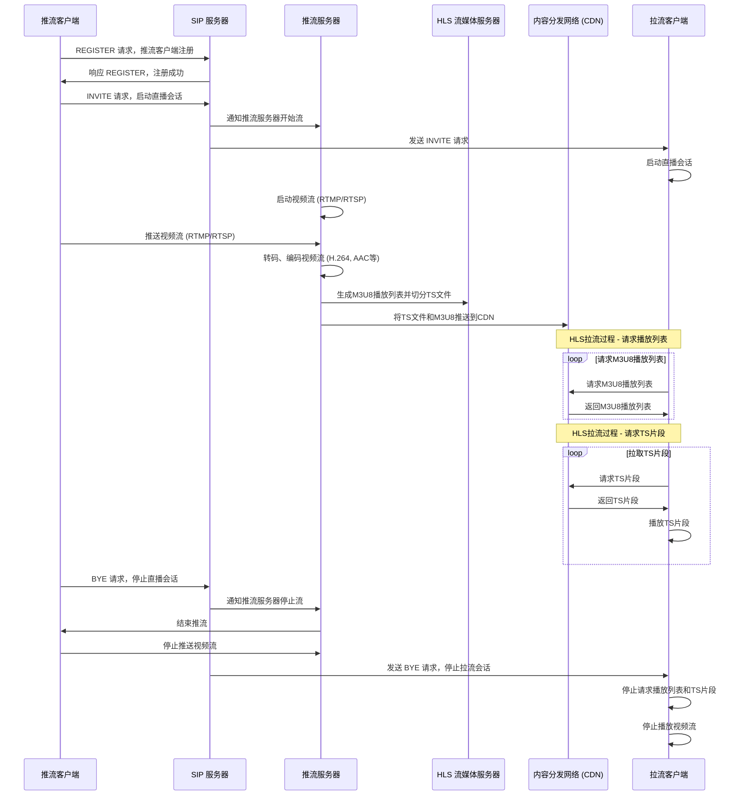
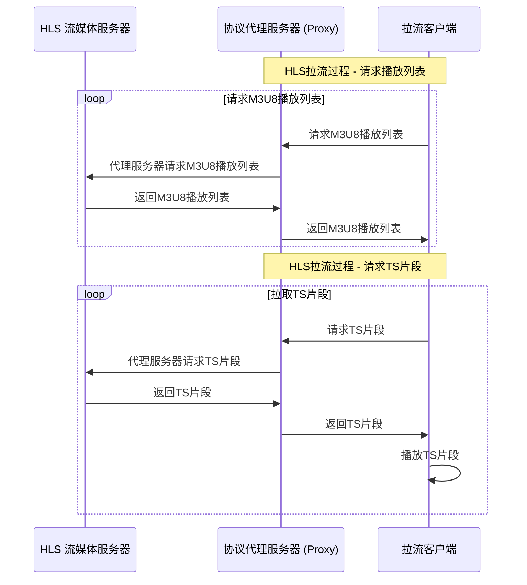

<h1 align="center"><strong>HLS实时视频流协议</strong></h1>


- [1. 什么是 HTTP 实时流（HLS）？](#1-什么是-http-实时流hls)
  - [1.1 自适应比特率流式传输](#11-自适应比特率流式传输)
  - [1.2 协议规范](#12-协议规范)
    - [1.2.1 M3U8 文件格式](#121-m3u8-文件格式)
- [2. HLS 如何工作？](#2-hls-如何工作)
  - [2.1 服务器](#21-服务器)
    - [2.1.1 推流服务器](#211-推流服务器)
    - [2.1.2 拉流服务器](#212-拉流服务器)
  - [2.2 客户端](#22-客户端)
    - [2.2.1 客户端实现概述](#221-客户端实现概述)
    - [2.2.2 主要平台的 HLS 支持](#222-主要平台的-hls-支持)
    - [2.2.3 客户端播放流程](#223-客户端播放流程)
  - [2.3 一个简单的直播流程示意图](#23-一个简单的直播流程示意图)
- [3. HLS 的协议代理](#3-hls-的协议代理)
- [4. 演示环境搭建](#4-演示环境搭建)
  - [4.1 环境准备](#41-环境准备)
  - [4.2 基于docker搭建](#42-基于docker搭建)
    - [4.2.1 编译nginx+rtmp](#421-编译nginxrtmp)
    - [4.2.2 启动服务器](#422-启动服务器)
    - [4.2.3 编写配置文件](#423-编写配置文件)
  - [4.3 客户端推流](#43-客户端推流)
    - [4.3.1 安装 OBS Studio](#431-安装-obs-studio)
    - [4.3.2 配置 OBS 进行推流](#432-配置-obs-进行推流)
  - [4.4 客户端播放](#44-客户端播放)
    - [4.4.1 演示文件](#441-演示文件)
    - [4.4.2 访问](#442-访问)
  

<div style="page-break-after: always;"></div>


# 1. 什么是 HTTP 实时流（HLS）？

* HTTP Live Streaming（HLS）是由苹果公司开发的一种流媒体网络传输协议, 
* 它允许视频内容通过HTTP进行分发，特别适合互联网上的**直播**和**点播**服务。
* HLS的设计初衷是为了兼容广泛存在于网络上的HTTP缓存系统(CDN)，使得视频可以高效地被传递到用户的设备上。
* 随着HLS的普及，现在几乎所有主流的移动操作系统、智能电视和其他联网设备都支持这一协议。
* 流式传输：它通过连续地将媒体文件发送到用户设备来工作，一次传输一小部分，而不是一次性传输全部。
   * 原始媒体文件可以存储在远程位置，或者在实时流式传输的情况下，可以使用远程摄像机或麦克风实时创建。这样，视频或音频可以开始播放，无需用户的设备预先下载整个文件。
  
## 1.1 自适应比特率流式传输
  * 根据网络条件变化而在流的中间调整视频质量的能力。即使网络条件变差，此功能也可以使视频继续播放；相反，它也可以最大化视频质量，达到网络可以支持的最高质量。
  * 如果网络速度变慢，用户的视频播放器会检测到，自适应比特率流式传输就会降低流的质量，从而使视频不会停止播放。如果有更多网络带宽可用，则自适应比特率流式传输将提高流的质量。
  * 自适应比特率流式传输之所以成为可能，是因为 HLS 在分段过程中创建了多个不同质量级别的重复流片段。用户的视频播放器可以在视频播放期间从这些流之一切换到另一个流。

## 1.2 协议规范
* [苹果官网](https://developer.apple.com/streaming/)
* [RFC8216](https://datatracker.ietf.org/doc/html/rfc8216/)

### 1.2.1 M3U8 文件格式
    
    M3U8文件是HLS协议中使用的播放列表文件，它是一个文本文件，包含了视频流中各个媒体片段的列表。每个片段通常是一个`.ts`文件，包含了视频、音频或其他数据。M3U8文件还包含了每个片段的持续时间和其他可选信息，如码率、分辨率等。
    M3U8文件的基本结构包括以下几个部分：
    
1. **文件头**：文件的第一行通常是`#EXTM3U`，表示这是一个M3U8格式的播放列表文件。
2. **文件格式说明**：文件中可能包含一些以`#`开头的行，这些行提供了播放列表的格式信息，例如：
    - `#EXT-X-TARGETDURATION`：指定播放列表中所有媒体片段的最大持续时间。
    - `#EXT-X-MEDIA-SEQUENCE`：指定播放列表中第一个媒体片段的序列号。
    - `#EXT-X-ENDLIST`：表示播放列表是完整的，没有更多的媒体片段。
3. **媒体片段条目**：
   文件中的其他行通常是媒体片段的描述，每个条目代表一个`.ts`文件，例如：
    ```m3u8
    #EXTINF:10,
    http://example.com/path/to/video_segment_001.ts
    #EXTINF:12,
    http://example.com/path/to/video_segment_002.ts
    #EXTINF:11,
    http://example.com/path/to/video_segment_003.ts
    ...
    ```

4. 完整的示例：
    ```m3u8
    #EXTM3U
    #EXT-X-VERSION:3
    #EXT-X-MEDIA-SEQUENCE:0
    #EXT-X-TARGETDURATION:4
    #EXT-X-DISCONTINUITY
    #EXTINF:4.166,
    stream-0.ts
    #EXTINF:4.167,
    stream-1.ts
    #EXTINF:4.166,
    stream-2.ts
    #EXTINF:4.167,
    stream-3.ts
    #EXTINF:3.083,
    stream-4.ts
    ```

<div style="page-break-after: always;"></div>

# 2. HLS 如何工作？


## 2.1 服务器
### 2.1.1 推流服务器
服务器上的主要过程：
1. **编码**：重新格式化视频数据，以便任何设备都能识别和解析数据。HLS 必须使用 H.264 或 H.265 编码。
2. **分段**：视频分成长度为几秒钟的片段。片段长度可变，但默认长度为 6 秒（2016 年为止是 10 秒）。
    * 除了将视频分割为片段外，HLS 还创建视频片段的索引文件`m3u8`，以记录它们所属的次序。
    * HLS 还会创建几组不同质量等级的重复片段：480p、720p 和 1080p 等。
3. **分发**：将视频片段和索引文件推送到拉流服务器或CDN，以便用户可以轻松地从任何位置访问它们。
4. **回放支持**：为了支持视频内容的回放，推流服务器需要保留已编码和分段的视频片段，并确保这些片段可以通过HLS播放列表（m3u8文件）访问。这样，用户可以随时请求并播放过去的视频内容。

### 2.1.2 拉流服务器
拉流服务器的实现相对简单，因为它主要负责从存储位置（如CDN）获取HLS流媒体内容，并将其提供给客户端设备。以下是拉流服务器的一些关键点：

1. **内容获取**：拉流服务器从推流服务器或CDN获取HLS流媒体内容，包括视频片段（.ts文件）和播放列表（m3u8文件）。
2. **请求处理**：当客户端请求流媒体内容时，拉流服务器会根据请求提供相应的m3u8播放列表和ts视频片段。
3. **缓存机制**：为了提高效率和减少延迟，拉流服务器通常会实现缓存机制，存储最近使用的视频片段。
4. **负载均衡**：在高流量的情况下，拉流服务器可能需要实现负载均衡，以确保所有客户端请求都能得到及时响应。
5. **安全性**：拉流服务器还需要考虑安全性问题，如防止未授权访问和数据泄露。

由于HLS基于HTTP协议，因此可以使用任何标准的Web服务器（如Apache、Nginx等）来作为拉流服务器。这些服务器可以通过配置来优化HLS内容的传输。

## 2.2 客户端
  * 客户端是接收流并播放视频的设备，例如用户的智能手机或笔记本电脑。
  * 客户端使用索引文件作为参考，以正确的顺序组装视频。如果网络条件变化，播放器会自动选择合适的质量级别，以保证流畅播放。
  
### 2.2.1 客户端实现概述
  HLS 在各种平台上的客户端实现通常涉及以下几个关键组件：
  1. **播放器控件**：提供播放、暂停、快进、倒退等基本播放控制。
  2. **解码器**：负责解码 HLS 流中的视频和音频数据。
  3. **缓冲管理**：管理视频数据的缓冲，确保播放流畅。
  4. **网络模块**：负责与 HLS 服务器通信，请求播放列表和媒体片段。
  5. **自适应比特率管理**：根据网络状况动态选择最佳质量的流。
  
### 2.2.2 主要平台的 HLS 支持
  - **iOS**：使用 `AVFoundation` 框架中的 `AVPlayer` 类来实现 HLS 播放。
  - **Android**：可以使用 `ExoPlayer` 或 `MediaPlayer` 来支持 HLS。
  - **Web**：HTML5 的 `<video>` 元素原生支持 HLS，通过 `m3u8` 播放列表进行流媒体播放。但要注意，并非所有浏览器或视频播放器都原生支持 HLS，对于不支持的浏览器，可能需要使用第三方库如 Video.js 或 hls.js 来实现 HLS 播放。 
  - **其他平台**：如 macOS, tvOS 等，通常也有类似的框架或库来支持 HLS 播放。
  
### 2.2.3 客户端播放流程
  1. **初始化播放器**：创建播放器实例并配置必要的参数。
  2. **加载播放列表**：请求并解析 `m3u8` 播放列表文件。
  3. **请求媒体片段**：根据播放列表中的信息，按顺序请求并下载媒体片段（通常是 `.ts` 文件）。
  4. **解码和播放**：解码下载的媒体片段并开始播放。
  5. **自适应比特率调整**：监听网络状况，动态调整播放质量。 

## 2.3 一个简单的直播流程示意图


<div style="page-break-after: always;"></div>

# 3. HLS 的协议代理
* HLS协议代理: 代理的是拉流服务器(Web服务器)
* 使用nginx的http反向代理模块，实现hls协议代理



<div style="page-break-after: always;"></div>

# 4. 演示环境搭建
## 4.1 环境准备
* 推流服务器 `nginx + rtmp`
* 拉流服务器 `nginx + hls`
* 代理服务器 `nginx + http反向代理`
* 推流客户端 `OBS`
* 拉流客户端 `浏览器 + Video标签 + hls.js`
  
## 4.2 基于docker搭建
### 4.2.1 编译nginx+rtmp
```Dockerfile
# 使用 Ubuntu 作为基础镜像
FROM ubuntu:20.04

# 设置环境变量，避免交互式安装
ENV DEBIAN_FRONTEND=noninteractive

# 安装 NGINX 和编译 RTMP 模块的依赖
RUN apt-get update && apt-get install -y \
build-essential \
libpcre3 libpcre3-dev \
libssl-dev \
zlib1g zlib1g-dev \
git \
wget \
curl \
libnginx-mod-rtmp \
&& rm -rf /var/lib/apt/lists/*

# 下载并解压 NGINX 和 RTMP 模块的源码
WORKDIR /tmp
RUN wget http://nginx.org/download/nginx-1.25.0.tar.gz \
&& tar -zxvf nginx-1.25.0.tar.gz \
&& rm nginx-1.25.0.tar.gz

# 获取并编译 RTMP 模块
RUN git clone https://github.com/arut/nginx-rtmp-module.git

# 编译和安装 NGINX
WORKDIR /tmp/nginx-1.25.0
RUN ./configure --with-compat --add-module=/tmp/nginx-rtmp-module
RUN make
RUN make install

# 清理
RUN rm -rf /tmp/nginx-1.25.0 /tmp/nginx-rtmp-module

# 创建 HLS 目录
RUN mkdir -p /tmp/hls

# 暴露所需端口
EXPOSE 1935 8080

# 设置工作目录
WORKDIR /usr/local/nginx

# 启动 NGINX
CMD ["sbin/nginx", "-g", "daemon off;"]
```

### 4.2.2 启动服务器
* 使用docker compose 做服务编排
* 推流服务器端口: 1935
* HLS播放服务器端口: 8080
* 反向代理服务器端口: 80
* 服务编排文件(包含流媒体服务器、反向代理服务器)如下：
```yml
version: '3.7'

services:
nginx-rtmp:
    image: nginx-rtmp
    ports:
    - "1935:1935" # RTMP 推流端口
    - "8080:8080" # HLS 流媒体播放端口
    volumes:
    - ./nginx.conf:/usr/local/nginx/conf/nginx.conf
    # - ./hls:/tmp/hls # 存放 HLS 分片的目录
    - ./html:/usr/local/nginx/html # 将 html 目录挂载到 NGINX 静态目录
    restart: always
    environment:
    - TZ=Asia/Shanghai # 设置时区，可根据需求调整

nginx-proxy:
    image: nginx
    ports:
    - "80:80" # 将主机的80端口映射到容器的80端口
    volumes:
    - ./proxy.conf:/etc/nginx/conf.d/default.conf # 挂载反向代理配置文件
    restart: always
    depends_on:
    - nginx-rtmp
```

### 4.2.3 编写配置文件
* nginx.conf(流媒体服务器)
```nginx
# 默认配置，设置 HTTP 服务器和 RTMP 流媒体
worker_processes 1;

events {
    worker_connections 1024;
}


rtmp {
    server {
        listen 1935; # RTMP标准端口
        chunk_size 4096;

        application live {
            live on;
            record off;

            # 启用HLS
            hls on;
            hls_path /tmp/hls;
            hls_fragment 3s;
            hls_playlist_length 60s;
        }

    }
}

http {
    server {
        listen 8080;

        # 静态文件根目录设置
        root /usr/local/nginx/html;

        # 配置默认页面
        location / {
            index index.html;
        }
        
        location /hls {
            alias /tmp/hls;
            add_header 'Access-Control-Allow-Origin' '*' always;
            add_header Cache-Control no-cache;
            types {
                application/vnd.apple.mpegurl m3u8;
                video/mp2t ts;
            }
        }
    }
}
```

* nginx配置(代理服务器)
```nginx
server {
    listen 80;

    location / {
        proxy_pass http://nginx-rtmp:8080; # 确保后端服务地址正确
        proxy_set_header Host $host;
        proxy_set_header X-Real-IP $remote_addr;
        proxy_set_header X-Forwarded-For $proxy_add_x_forwarded_for;
        proxy_set_header X-Forwarded-Proto $scheme;
    }

    error_page 500 502 503 504 /50x.html;
    location = /50x.html {
        root /usr/share/nginx/html;
    }
}
```

* 启动服务
```bash
docker-compose up -d
```
        
## 4.3 客户端推流
### 4.3.1 安装 OBS Studio
* 前往 OBS Studio 官方网站 下载并安装适用于您操作系统的版本。

### 4.3.2 配置 OBS 进行推流
* 打开 OBS Studio，点击“设置”->“流”，选择“自定义流密钥”作为服务类型，并填写如下信息：

  * 服务器：rtmp://<your-server-ip>:1935/live
  * 流密钥：stream （或任何您想要的字符串）
  * 点击“应用”保存设置，然后点击“开始推流”按钮开始向 Nginx 服务器推送视频流。

## 4.4 客户端播放
HLS.js 是一个开源的 JavaScript 库，支持在不兼容原生 HLS 的浏览器中播放 HLS 流。可以直接在HTML文件中引入 HLS.js。

### 4.4.1 演示文件
```html
<!DOCTYPE html>
<html>
<head>
    <title>HLS Video Player</title>
    <script src="js/hls.js"></script>
</head>
<body>
    <video id="video" controls></video>
    <script>
        var video = document.getElementById('video');
        // 动态生成视频流地址
        const currentHost = window.location.origin; // 获取当前浏览器地址 (例如 http://127.0.0.1:8080)
        const videoSrc = `${currentHost}/hls/stream.m3u8`; // 拼接 HLS 流地址

        console.log("videosrc:", videoSrc)

        if (Hls.isSupported()) {
            var hls = new Hls();
            hls.loadSource(videoSrc);
            hls.attachMedia(video);
            hls.on(Hls.Events.MANIFEST_PARSED, function() {
                video.play();
            });
        } else if (video.canPlayType('application/vnd.apple.mpegurl')) {
            // 如果浏览器原生支持 HLS，则直接设置 src 属性
            video.src = videoSrc;
            video.addEventListener('loadedmetadata', function() {
                video.play();
            });
        }
    </script>
</body>
</html>
```

### 4.4.2 访问
在浏览器中目标页面, 即可观看通过 OBS 推送的 HLS 流。
* 直接访问：[http://localhost:8080](http://localhost:8080)
* 通过反向代理访问：[http://localhost](http://localhost)


---

感谢阅读！如果你有任何问题或反馈，请随时[与我联系](mailto:wuxiaojian@zhongfu.net)。
相关资源可访问 [Github](https://github.com/letsdemo/hls) 获取。


<p style="text-align: right;">2024年12月24日</p>