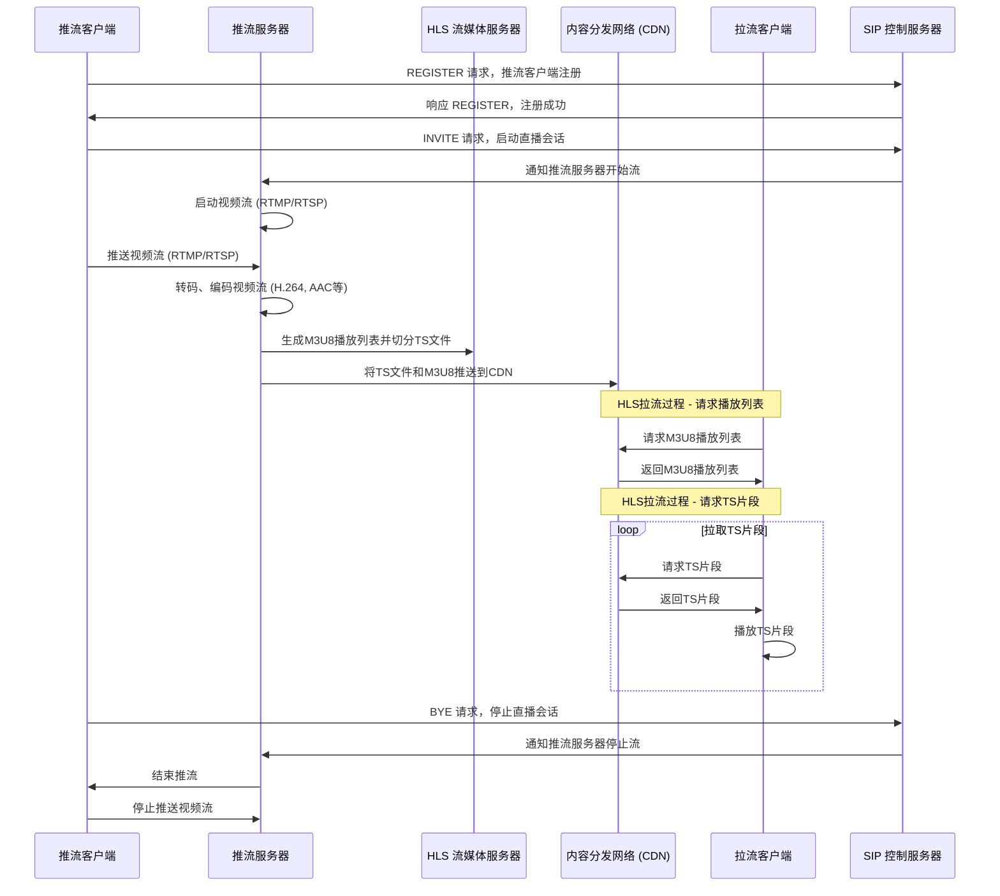

```mermaid
sequenceDiagram
    participant A as 推流客户端
    participant S as 推流服务器
    participant HLS as HLS 流媒体服务器
    participant CDN as 内容分发网络 (CDN)
    participant B as 拉流客户端
    participant SIP as SIP 控制服务器

    %% 推流客户端注册
    A->>SIP: REGISTER 请求，推流客户端注册
    SIP->>A: 响应 REGISTER，注册成功

    %% 会话控制流程
    A->>SIP: INVITE 请求，启动直播会话
    SIP->>S: 通知推流服务器开始流

    %% 推流服务器启动流
    S->>S: 启动视频流 (RTMP/RTSP)
    A->>S: 推送视频流 (RTMP/RTSP)

    %% 视频流编码与推送到 CDN
    S->>S: 转码、编码视频流 (H.264, AAC等)
    S->>HLS: 生成M3U8播放列表并切分TS文件
    S->>CDN: 将TS文件和M3U8推送到CDN

    %% 拉流客户端请求播放列表
    Note over B, CDN: HLS拉流过程 - 请求播放列表
    B->>CDN: 请求M3U8播放列表
    CDN->>B: 返回M3U8播放列表

    %% 拉流客户端请求 TS 片段
    Note over B, CDN: HLS拉流过程 - 请求TS片段
    loop 拉取TS片段
        B->>CDN: 请求TS片段
        CDN->>B: 返回TS片段
        B->>B: 播放TS片段
    end

    %% 停止直播
    A->>SIP: BYE 请求，停止直播会话
    SIP->>S: 通知推流服务器停止流
    S->>A: 结束推流
    A->>S: 停止推送视频流

```